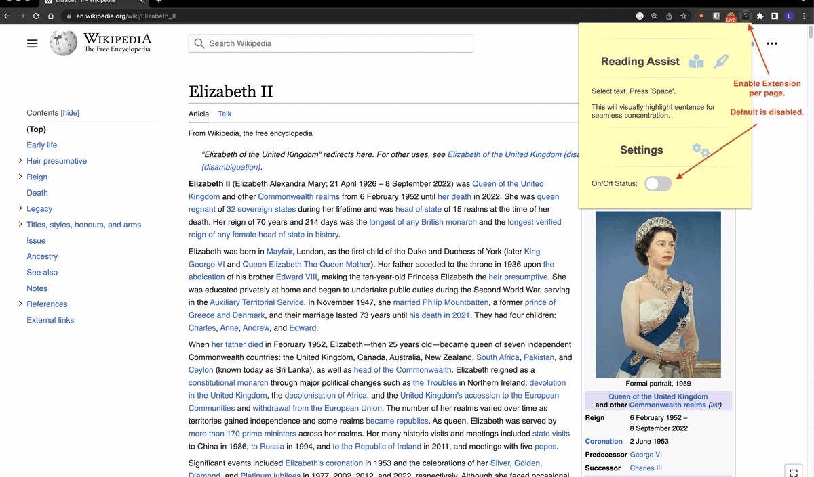

# Usage Demo

# Chrome Extension for Seamless Reading using Visual Pointer Cue.

Are you tired of scrolling through long digital documents or books and losing track of where you are? Do you ever find yourself re-reading the same sentence multiple times because you lost your spot?

We have a solution for you. We developed a **feature that selects and highlights the current sentence being read** as a visual cue for readers. This feature enhances the reading experience by providing clear cues on the sentence you are currently reading, helping you to maintain focus and engagement with the content.

## Video Demo

To see our feature in action and better understand its benefits, watch our video demonstration. This demo showcases how our sentence selection and highlighting feature functions and how it can significantly improve your reading focus.

By clicking on the image above or following this link, you can access our video demo: 

https://www.loom.com/share/b17f9d891f3b408d8ff52fb7a2f81a45

## Usage

Our feature is easy to use and seamlessly integrates with existing web applications. To select a sentence in an article, simply highlight a word or phrase, press **space bar**, and our feature will determine the current sentence based on cursor position and surrounding text. The chosen sentence will be highlighted in real-time as you scroll through the document.

## Installing Reading Assist Chrome Extension

This section explains how to install the Reading Assist extension. 

### Option 1: Install via Chrome Extension Store [Recommended]
1. Install via Chrome Extension Store - [link](https://chrome.google.com/webstore/detail/reading-assist/mdpcpdnelomalncmjbdcnledmmfepkco).

### Option 2: Github load unpacked extension

1. Visit [github repo](https://github.com/llj0824/readingAssist).
2. Click the green "Code" button.
3. In the dropdown menu, choose "Download ZIP".
4. Extract the contents of the downloaded ZIP file to a folder on your computer.
5. Open Google Chrome and go to `chrome://extensions/`.
6. Enable "Developer mode" using the toggle at the top-right corner of the page.
7. Click "Load unpacked" and select the folder containing the extracted files from Step 1.
8. The Reading Assist extension should now be installed and appear in the list of extensions.

## Uninstalling/Disabling Reading Assist Chrome Extension

To uninstall visit `chrome://extensions/`, find the Reading Assist extension, and either click "Remove" to uninstall or toggle off the switch to disable it temporarily.

## Upcoming Functionality
- Shift + Space bar -> goes backwards.
- Option to highlight by paragraph or sentence.
- Allow users to customize highlight color.

## Upcoming Support
- Add literature on visual pointer effect on reading comprehension and speed. 
- Support reading PDFs | read.amazon.com
- Reading lists `<ol>`/`<ul>` and table `<td>`/`<tr>`?

## Upcoming UI Changes
- Change automatic scrolling of screen - it can be disorienting right now
